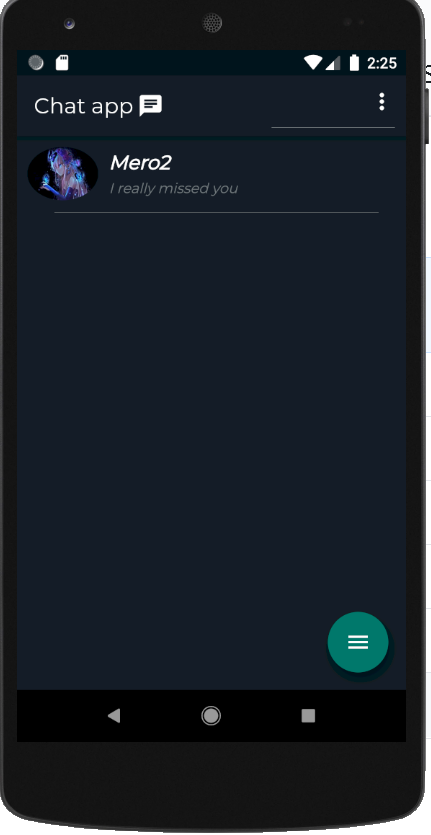
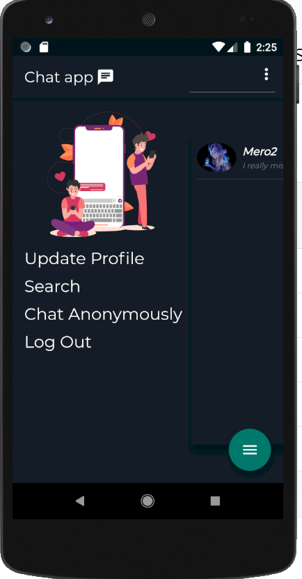
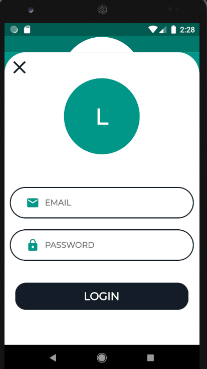
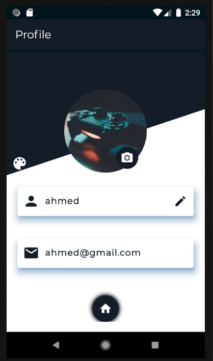
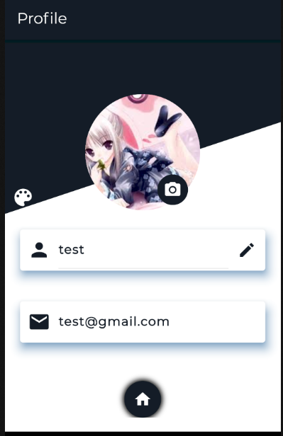
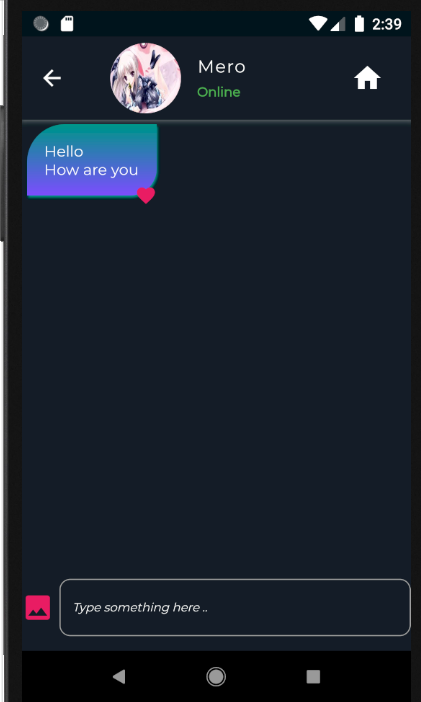

Flutter chat application made with Firebase database  where you can chat your friends or chat anomalously which is a feature that make you see random people to chat with .. 
The app have a great design and smooth user utility. Also information is authenticated with firebase.
You can update profile , search by phone number , upload images in chat .
 
Row<

/>

/>
